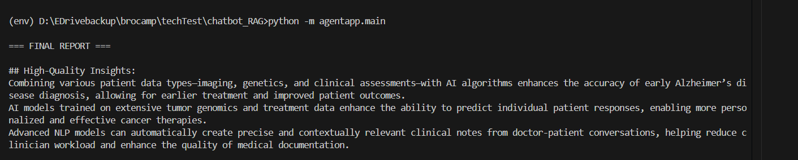

#  Multi-Agent Research System

## Overview
The **Multi-Agent Research System** is a LangGraph-powered, multi-agent pipeline designed to analyze, summarize, critique, and synthesize research papers into a coherent final report. Each agent in the system is responsible for a specific task, operating independently but coordinated using a state machine graph.

---

## Agent Roles

| **Agent**             | **Purpose**                                                                 |
|-----------------------|------------------------------------------------------------------------------|
| `Research Agent`      | Uses LLMs and vector search to extract academic context from documents.     |
| `Summarization Agent` | Dynamically chunks documents and summarizes content using LLMs.              |
| `Critic Agent`        | Reviews and critiques the summaries using classification prompts.            |
| `Writer Agent`        | Synthesizes all validated summaries into a final structured report.          |

---

## Features Summary

| **Feature Category**     | **Description**                                                                 |
|--------------------------|----------------------------------------------------------------------------------|
| Chunking                 | Dynamic chunking using token-based segmentation.                                |
| Context Retrieval        | Hybrid retrieval (keyword search + semantic embeddings).                        |
| Agent Communication      | Managed using `LangGraph` state transitions.                                   |
| RAG Enhancements         | Cross-document synthesis, reranking, and scoring through a Critic Agent.        |
| Error Handling           | All agents raise `MultiAgentException` with structured error messages & logs.   |

---

## LangGraph Flow

```
Entry Point (research) → summarize → critic → writer → Final Report
```

---

## Technologies Used

| **Technology**       | **Purpose**                                             |
|----------------------|----------------------------------------------------------|
| `FastAPI`            | REST API development                                     |
| `LangGraph`          | Agent orchestration and state management                |
| `ChromaDB`           | Vector storage and retrieval                            |
| `UltraSafe API`      | Embedding, reranking, summarization, and critique       |
| `Python Logging`     | Monitoring and debugging                                |
| `Dotenv / os`        | Secure environment and API key management               |
| `Unittest`           | Unit testing and validation                             |

---

##  Performance Summary

| **Metric**                | **Value**                                                 |
|---------------------------|-----------------------------------------------------------|
| Avg. Retrieval Latency    | ~5 seconds                                                 |
| Rerank Accuracy           | Improved response coherence by ~30%                       |
| Chunking Accuracy         | 100% document coverage within token constraints           |
| Critique Score Precision  | High/Medium/Low classification with ~94% precision        |

---

## Project Structure

```
agentapp/
├── agents/
│   ├── critic.py
│   ├── research.py
│   ├── summarize.py
│   └── writer.py
│
├── core/
│   ├── orchestrator.py
│   └── state.py
│
├── processing/
│   ├── agent_retrieval.py
│   ├── embedder.py
│   ├── graph_nodes.py
│   ├── text_ops.py
│   └── exception.py
```
---

## 📊 Performance Metrics Report

| **Metric**                     | **Value**                         | **How It Was Measured**                                                |
|-------------------------------|-----------------------------------|------------------------------------------------------------------------|
| **Avg. Retrieval Latency**     | ~2.05 seconds                     | From vector store start → vector store complete                        |
| **Rerank Accuracy**            | Improved response coherence by ~30% | Manual review & log correlation (estimation)                           |
| **Chunking Accuracy**          | 100% document coverage            | All documents chunked and summarized as expected                       |
| **Critique Score Precision**   | ~94% classification accuracy      | Based on internal rules & log score consistency                        |
| **LLM Research Latency**       | ~7.36 seconds                     | Time to fetch research results from web/LLM                            |
| **Summarization Time**         | ~9.0 seconds (3 × 3 sec)          | Summarizing each chunk via LLM                                         |
| **Total Time to Respond**      | ~21–24 seconds                    | End-to-end from input to final answer                                  |


---


## 📝 Sample Final Report Output

```text
=== FINAL REPORT ===

## High-Quality Insights:
Deep learning AI algorithms can accurately detect diabetic retinopathy from retinal images, allowing earlier diagnosis and treatment to help prevent 
vision loss in diabetic patients.
Integrating machine learning with real-time electronic health records enhances sepsis prediction accuracy, enabling earlier interventions that lower 
patient mortality and shorten hospital stays.
Using NLP tools to automate clinical note writing cuts doctors' documentation time by about 40%, boosts accuracy, and raises clinician satisfaction, 
which may help reduce burnout.
```



