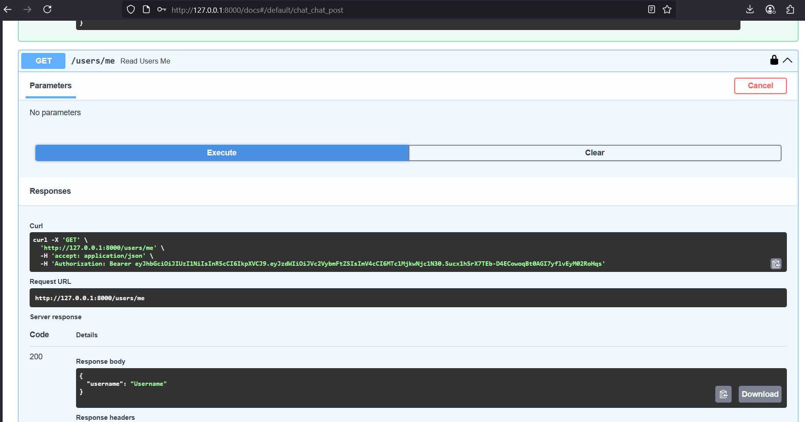
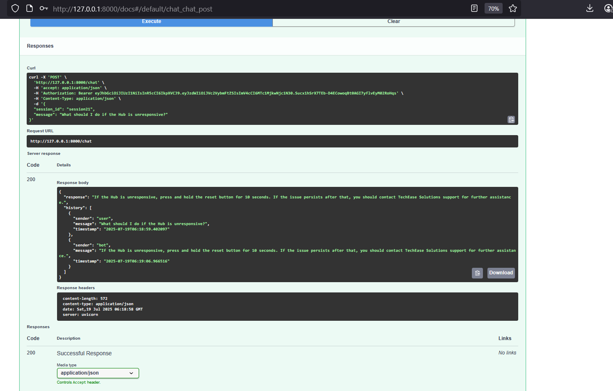

# FastAPI Chatbot with Retrieval-Augmented Generation (RAG)

A secure, intelligent chatbot application built using **FastAPI**, **JWT authentication**, **ChromaDB**, and **UltraSafe LLM APIs**. This system uses **Retrieval-Augmented Generation (RAG)** to answer user queries based on embedded PDF documents.

---

## Features

| Feature                | Description                                                                 |
|------------------------|-----------------------------------------------------------------------------|
| JWT Authentication     | Secure login and token-based access for users                               |
| Chat Endpoint          | Session-based conversation logging with user/bot roles                      |
| PDF Ingestion          | Embeds PDF documents using `usf1-embed` and stores them in ChromaDB         |
| RAG Flow               | Query → Embed → Search ChromaDB → Generate LLM Response                     |
| LLM Completion         | Generates smart answers using `usf1-mini` based on retrieved context         |
| Conversation History   | Full chat history stored in a relational DB (SQLite/PostgreSQL)             |
| Modular Codebase       | Clean structure with reusable components and exception handling              |

---

## Project Structure

```
chatapp/
├── main.py                         # FastAPI entry point with /token, /users/me, /chat endpoints
├── __init__.py                     # Marks this as a Python package
│
├── core/                           # Core logic for auth and RAG
│   ├── __init__.py
│   ├── auth.py                     # JWT authentication and password hashing
│   └── rag_retriever.py            # RAG logic: PDF embedding, ChromaDB retrieval
│
├── db/                             # Database setup and models
│   ├── __init__.py
│   ├── db.py                       # SQLAlchemy engine, session factory, Base
│   └── models.py                   # User and ConversationHistory ORM models
├── logger.py                       # Logging config
├── exception.py                    # Custom exception handlers
```

---

## Example Workflow

1. **Login** and get a token:
```http
POST /token
Content-Type: application/x-www-form-urlencoded
```
**Body**:
```
username=Username&password=password
```

2. **Chat** with the bot:
```http
POST /chat
Authorization: Bearer <your_token>
Content-Type: application/json
```
```json
{
  "session_id": "abc123",
  "message": "What should I do if the Hub is unresponsive?"
}
```

3. **Sample Response**:
```json
{
  "response": "If the Hub is unresponsive, press and hold the reset button for 10 seconds. If the issue persists after that, you should contact TechEase Solutions support for further assistance.",
  "history": [
    { "sender": "user", "message": "What should I do if the Hub is unresponsive?" },
    { "sender": "bot", "message": "If the Hub is unresponsive..." }
  ]
}
```

---

## RAG Flow

```
User Query
   ↓
JWT Authentication
   ↓
Query Embedding (usf1-embed)
   ↓
Search ChromaDB for Top-k Chunks
   ↓
Generate Response (usf1-mini)
   ↓
Return Chat History
```

---

## Setup Instructions

1. **Install dependencies**:
```bash
pip install -r requirements.txt
```

2. **Set up environment variables** in `.env`:
```
SECRET_KEY=your_secret_here
DATABASE_URL=sqlite:///./chat.db
ULTRASAFE_API_KEY=your_ultrasafe_api_key
```

3. **Create database tables**:
```
python create_table.py
```

4. **Register user**:
```
python register_user.py
```

5. **Run the app**:
```
uvicorn chatapp.main:app --reload
```

---

## Performance Metrics

### Chat Query & Response Latency

| Step                        | Latency   |
|----------------------------|-----------|
| User Query → Context Fetch | 3.77 s    |
| Context → LLM Response     | 2.77 s    |
| Total Response Time        | 6.54 s    |

### Return Policy Response Evaluation

| Metric     | Score   | Precision | Recall  | F1 Score |
|------------|---------|-----------|---------|----------|
| BLEU Score | 0.1013  | -         | -       | -        |
| ROUGE-1    | -       | 0.2258    | 1.0000  | 0.3684   |
| ROUGE-2    | -       | 0.1639    | 0.7692  | 0.2703   |
| ROUGE-L    | -       | 0.2097    | 0.9286  | 0.3421   |

---

## Screenshots


